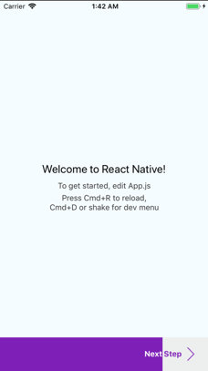

# RN Progress Button [](https://www.npmjs.com/package/rn-progress-button)

Awesome progress button made in React Native.

## Installation

`yarn add rn-progress-button` or `npm install rn-progress-button`

## How to use

First of all, you should import this package into your file.

`import RNProgressButton from "rn-progress-button"`

After this, you only need to use it :)

```jsx
<RNProgressButton />
```

## Screenshot



## Props

| Prop  | Default  | Type | Description |
| :------------ |:---------------:| :---------------:| :-----|
| completed | `85%` | `string` | How much of the process is already completed. |
| onPress | `() => {}` | `func` | Function that will be executed by clicking the main button (next). |
| secondaryOption | `{}` | `object` | If we are in 100% of the process and there is a value for this props, a new secondary button will be rendered. |
| renderLabel | `(labelColor, label) => {...}` | `func` | Method used to render the button label. |
| renderIcon | `(isActive) => {...}` | `bool` | Method used to render the button icon. |
| finishLabel | `Finish` | `string` | Label button when the process is at 100% |
| nextLabel | `Next Step` | `string` | Label button when the process is not yet at 100% |
| completedColor | `#7E1FB7` | `string` | Background and label color of the completed part |
| incompletedColor | `#EDEFEF` | `string` | Background and label color of the incompleted part |

Example:
```jsx
<RNProgressButton
    completed="40%"
    completedColor="red"
    incompletedColor="white"
    renderLabel={(labelColor, label) => {
        return <Text style={{ color: labelColor }}>{label}</Text>;
    }}
    renderIcon={isActive => {
        const isActiveImage = isActive
        ? require('@assets/images/icons/icContinueOff.png')
        : require('@assets/images/icons/icContinue.png');

        return <Image source={isActiveImage};
    }}
    onPress={() => {}}
/>
```
